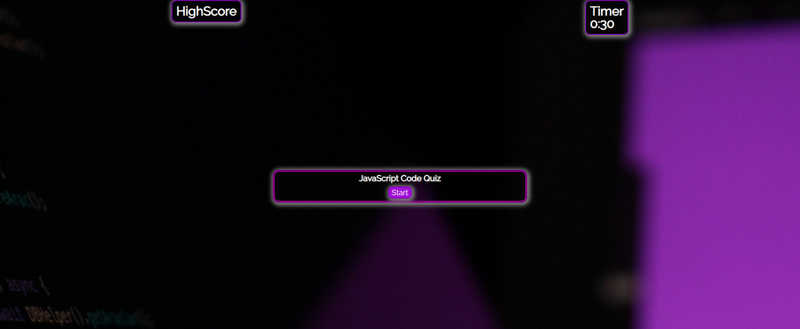
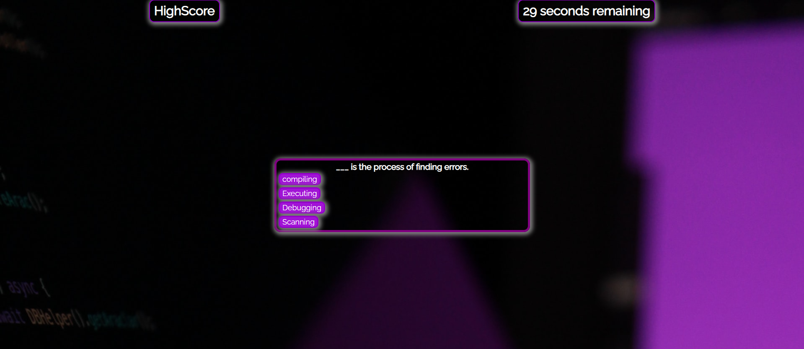
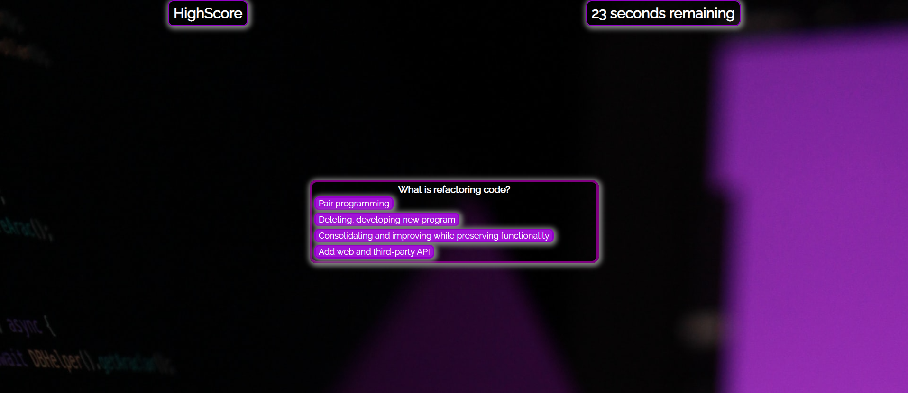
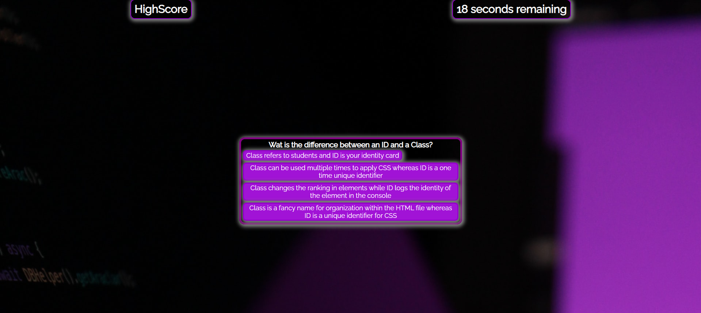
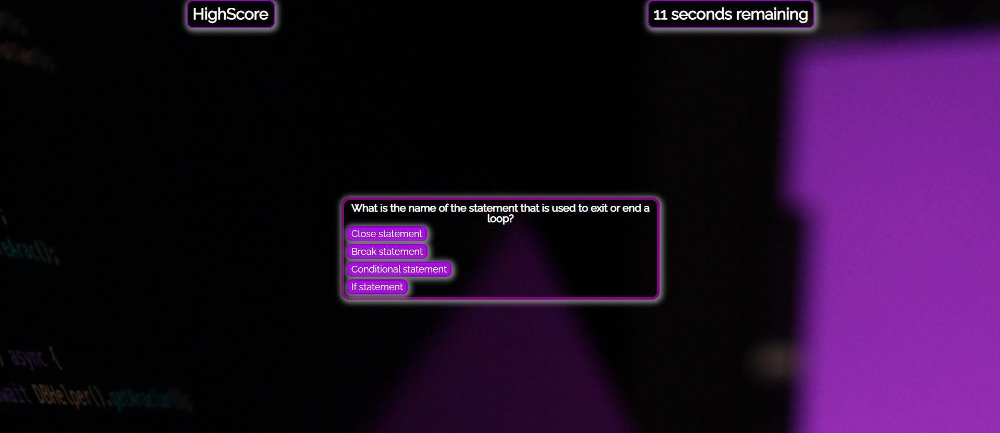
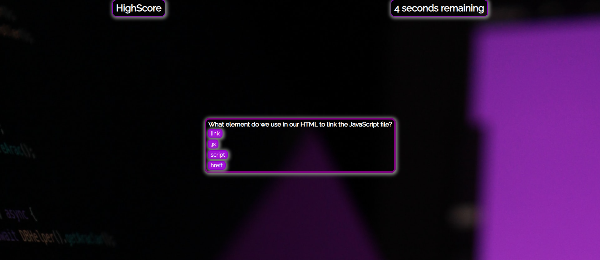
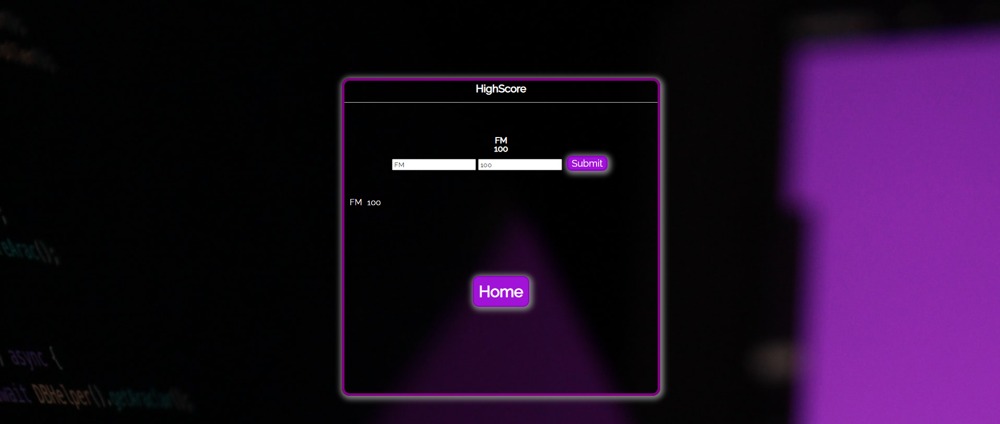
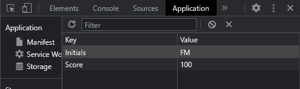

# CodeQuiz

## Description

This repository hosts a code quiz. You will have 30 seconds upon hitting the start button to take the quiz where you will be asked 5 questions pertaining to JavaScript. If you select the correct answer you will receive 20 points. Selecting the wrong answer will reduce the time you have to complete the quiz by 10 seconds making it possible for you to fail without completing all the questions. 

Upon completing the quiz or when the timer hits 0 you will be taken to a highscore page where you can input your initials and your score. Both of which will be saved to your localstorage for you to keep. 

## Technologies

- HTML  
- CSS
- JavaScript 

## Credits

- Collaboration and ideas with James Kelly https://www.linkedin.com/in/james-kelly-b93a94150/
- Background photo by Bestami Sarikaya https://unsplash.com/@bbestamis 

## Screenshots (Deployable Page Link)
Deployed page: https://fabien1313.github.io/codequiz/

## License

MIT License

Copyright (c) 2022 fabien1313

Permission is hereby granted, free of charge, to any person obtaining a copy
of this software and associated documentation files (the "Software"), to deal
in the Software without restriction, including without limitation the rights
to use, copy, modify, merge, publish, distribute, sublicense, and/or sell
copies of the Software, and to permit persons to whom the Software is
furnished to do so, subject to the following conditions:

The above copyright notice and this permission notice shall be included in all
copies or substantial portions of the Software.

THE SOFTWARE IS PROVIDED "AS IS", WITHOUT WARRANTY OF ANY KIND, EXPRESS OR
IMPLIED, INCLUDING BUT NOT LIMITED TO THE WARRANTIES OF MERCHANTABILITY,
FITNESS FOR A PARTICULAR PURPOSE AND NONINFRINGEMENT. IN NO EVENT SHALL THE
AUTHORS OR COPYRIGHT HOLDERS BE LIABLE FOR ANY CLAIM, DAMAGES OR OTHER
LIABILITY, WHETHER IN AN ACTION OF CONTRACT, TORT OR OTHERWISE, ARISING FROM,
OUT OF OR IN CONNECTION WITH THE SOFTWARE OR THE USE OR OTHER DEALINGS IN THE
SOFTWARE.